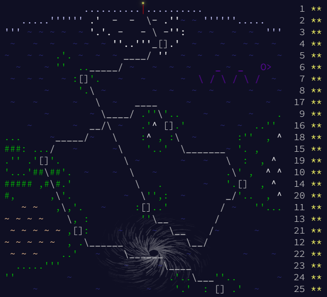

# 🎄 Advent of Code 2020 🎄

This repository contains my C++ solutions for [Advent of Code 2020](https://adventofcode.com/2020), an annual set of programming puzzles created by Eric Wastl.  

Each day of December unlocks a two-part puzzle, starting easy and getting progressively harder. They are a fun mix of algorithmic thinking, problem-solving, and sometimes even a little math.  

All solutions are stored in this folder as `01.cpp`, `02.cpp`, … up to `25.cpp` for each day.

---

## 🏆 All Stars Collected

All stars gathered, the journey is complete 🎄!

