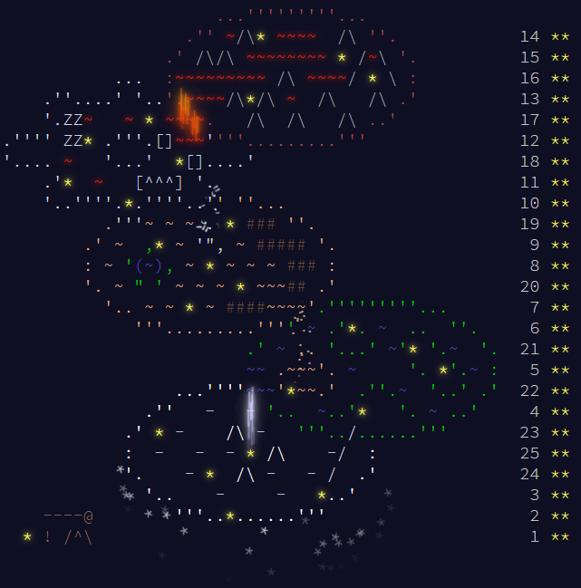
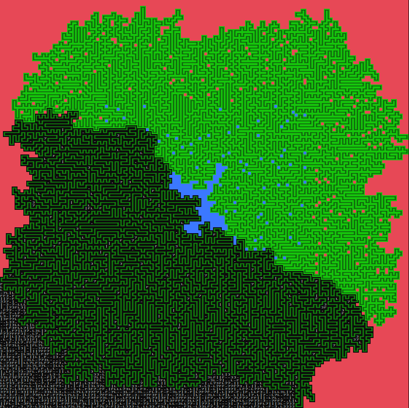
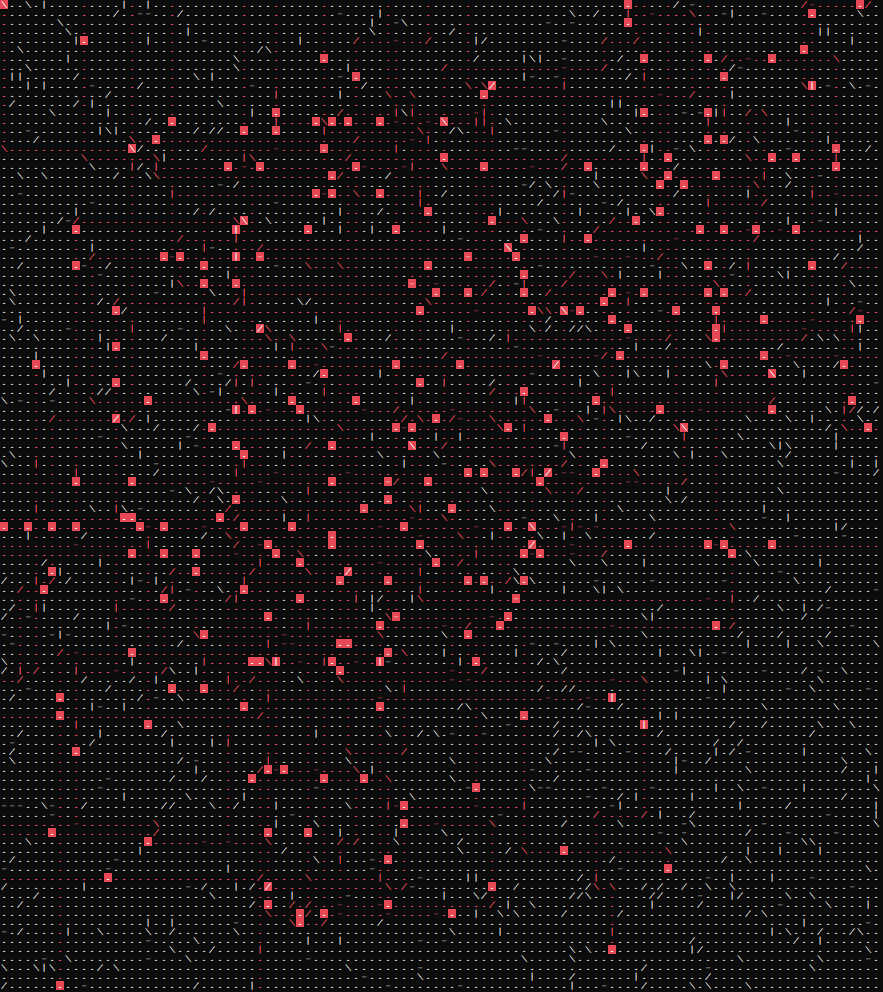

# 🎄 Advent of Code 2020 🎄

This repository section contains my C++ solutions for [Advent of Code 2023](https://adventofcode.com/2023), an annual set of programming puzzles created by Eric Wastl.  

Each day of December unlocks a two-part puzzle, starting easy and getting progressively harder. They are a fun mix of algorithmic thinking, problem-solving, and sometimes even a little math.  

All solutions are written in C++ without using any third-party libraries. They are stored in this folder as `01.cpp`, `02.cpp`, … up to `25.cpp` for each day.

---

## 🏆 All Stars Collected

All stars gathered, the journey is complete 🎄!

---

## 🌟 Highlights

Here days which I liked:

1. **Day 10** – very nice visualization of BFS in action.  
2. **Day 21** – demonstrates why careful observation of the input data is crucial.
3. **Day 22** – a nice cascade of algorithms, including a greedy approach, simple math, BFS, and topological sort.
4. **Day 24** – computational geometry + linear algebra; paperwork first, code later – linearizing physical equations.  
5. **Day 25** – solved using a customized version of the Stoer-Wagner algorithm.

---

## 🎨 Visualizations  

Some puzzles were suitable for visualizations, which help illustrate the problem dynamics:  
- **Console-based**: `10-console-visualization.cpp`, `16-console-visualization.cpp` (Day 16 uses a brute-force approach for nicer visualization; the real algorithm is in `16.cpp`)
- **SDL2-based**: folders `06.visualization` and `14.visualization`

These let you see the solutions in action and add a fun interactive element to the challenges.

Day 10 visualization - on the floating metal island.

Day 16 visualization - mirrors and splitters in the Lava Production Facility.

