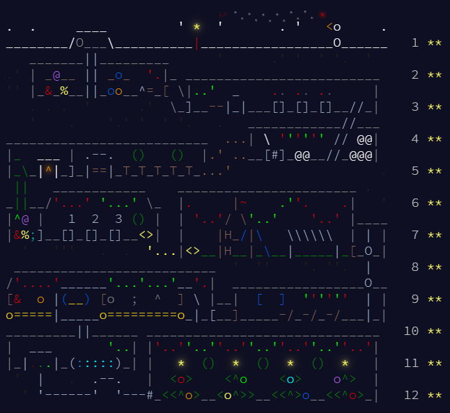
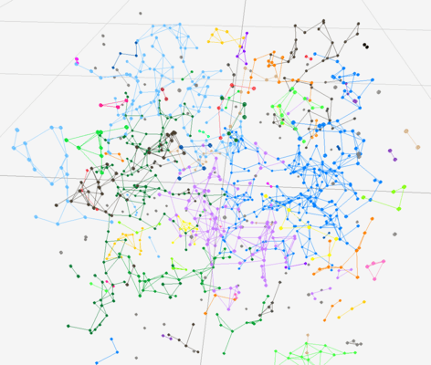

# 🎄 Advent of Code 2025 🎄

This repository section contains my C++ solutions for [Advent of Code 2025](https://adventofcode.com/2025), an annual set of programming puzzles created by Eric Wastl.

Each day of December unlocks a two-part puzzle, starting easy and getting progressively harder. They are a fun mix of algorithmic thinking, problem-solving, and sometimes even a little math.  

All solutions are written in C++ without using any third-party libraries, except day 10. They are stored in this folder as `01.cpp`, `02.cpp`, … up to `12.cpp` for each day.

---

## 🏆 All Stars Collected

All stars gathered, the journey is complete 🎄!

---

## 🌟 Highlights

Here days which I liked:

1. **Day 09** – computational geometry with data observation.  
2. **Day 10** – integer linear programming with SMT.

---

## 🎨 Visualizations  

Some puzzles were suitable for visualizations, which help illustrate the problem dynamics:  
- **Raylib-based**: `08-visualization.cpp` and `09.cpp`

These let you see the solutions in action and add a fun interactive element to the challenges.

Day 08 visualization - junction boxes.

